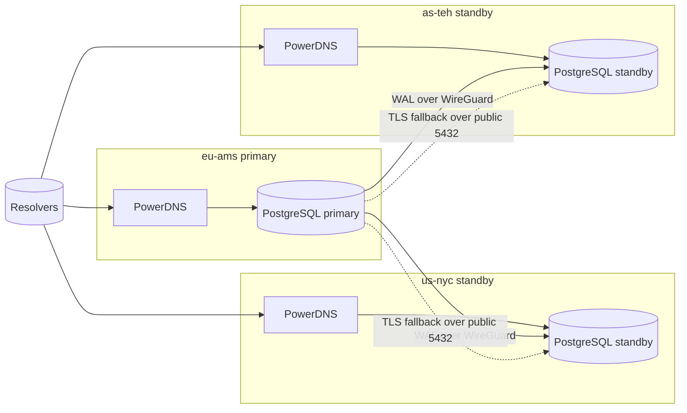

# powerdns-geo-cluster

Production-ready GEO authoritative DNS cluster using PowerDNS + PostgreSQL streaming replication.

## Minimal command surface

All setup and day-to-day operations run through one script:

```bash
./scripts/cluster.sh --help
```

Only two scripts exist in the repo:
- `scripts/cluster.sh`
- `scripts/lib.sh`

## Topology



## Step-by-step setup

1. Install dependencies on each node:
```bash
sudo ./scripts/cluster.sh install-deps
```

2. On control node:
```bash
cp env.example .env
./scripts/cluster.sh init
```

3. Apply WireGuard on each node:
```bash
sudo ./scripts/cluster.sh wireguard apply eu-ams
sudo ./scripts/cluster.sh wireguard apply us-nyc
sudo ./scripts/cluster.sh wireguard apply as-teh
```

4. Start services (primary first):
```bash
./scripts/cluster.sh up eu-ams
./scripts/cluster.sh up us-nyc
./scripts/cluster.sh up as-teh
```

5. Validate health:
```bash
./scripts/cluster.sh check eu-ams
./scripts/cluster.sh replication check eu-ams
./scripts/cluster.sh validate
```

## Day-to-day operations

```bash
./scripts/cluster.sh status eu-ams
./scripts/cluster.sh restart us-nyc
./scripts/cluster.sh backup eu-ams
./scripts/cluster.sh restore s3://bucket/path/backup.sql.gz.gpg eu-ams
./scripts/cluster.sh failover us-nyc
./scripts/cluster.sh monitoring on eu-ams
./scripts/cluster.sh monitoring off eu-ams
```

## Why this is easy and safe

- Single operational interface reduces mistakes.
- Single-writer primary avoids split-brain changes.
- Replication is secured via WireGuard and TLS verify-ca.
- CI validates shell/python/yaml/json on every PR.
