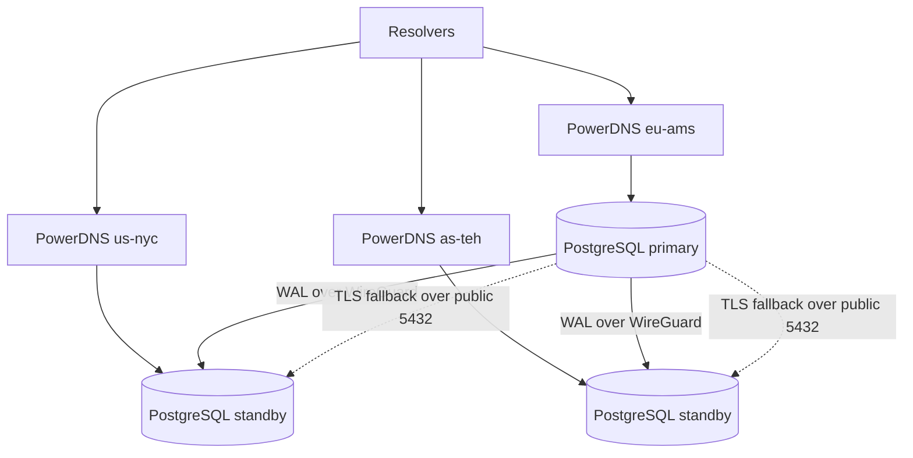

# Architecture

## Topology

## How it works

1. DNS changes are written on primary only.
2. PostgreSQL streaming replication distributes state to standbys.
3. Each location answers DNS from local DB.

## Why it is stable

- Single writer avoids conflict/split-brain writes.
- Local read copies keep latency low per region.
- WireGuard-first replication with TLS fallback keeps sync resilient.

## Operator model

All setup and operations are done with:

`./scripts/cluster.sh`
